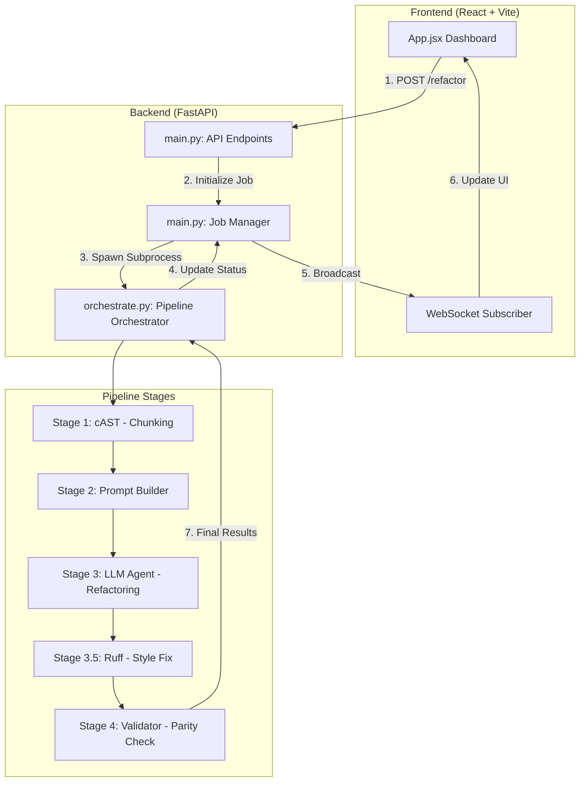

# AI Refactoring Pipeline: Root Logic Map

This document outlines the end-to-end logic flow of the SDP Refactor system, from user interaction in the frontend to final validation in the backend.

## ── High-Level Architecture ──

## ── Data Flow Logic ──

### 1. Request Initiation (`frontend/`)
- User selects files and configuration (Model, Batch Size, Delay).
- Files are uploaded to `backend/input/uploads/<job_id>`.
- A background task is triggered in the FastAPI backend.

### 2. Orchestration (`backend/orchestrate.py`)
- The orchestrator manages the lifecycle of a single refactoring job.
- **Isolation**: Each job operates in a unique directory `backend/output/<job_id>`.
- **Streaming**: It emits `::STAGE::n` markers to `stdout`, which are parsed in real-time by the backend to update the frontend.

### 3. Transformation Pipeline (`backend/pipeline/`)
- **Stage 1 (cAST)**: Deconstructs source files into semantic chunks (functions, classes).
- **Stage 2 (Prompt Builder)**: Generates high-context prompts for each chunk, including global file context and few-shot examples.
- **Stage 3 (LLM Agent)**: Calls the Gemini API (Gemma 3 family) to perform the actual refactoring.
- **Stage 3.5 (Linting)**: Runs `ruff` to ensure PEP 8 compliance and fix minor style errors automatically.
- **Stage 4 (Validator)**: Performs three checks:
    1. **Syntax**: Does the code compile?
    2. **AST Parity**: Was the structure preserved (no deleted methods)?
    3. **Functional**: Does the code pass its own unit tests?

### 4. Result Delivery
- Final results are serialized to JSON in the job-specific output folder.
- The frontend fetches the results and renders a side-by-side diff using the `DiffViewer` component.

## ── State Management ──
- **Backend**: In-memory `_jobs` dictionary stores status and metadata.
- **Frontend**: `jobStatus` state updated via WebSockets for progress and REST for final results.
