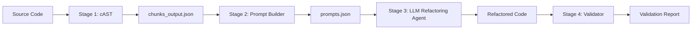

# 🚀 AI Refactoring Pipeline

An industrial-grade, end-to-end processing pipeline designed to transform legacy or "messy" Python codebases into high-quality, structured, and modern software architectures. Now evolved into a full **SaaS Platform** with a real-time FastAPI backend and a stunning Neumorphic dashboard.

---

## 🏗️ System Architecture

The pipeline processes code through four distinct stages to ensure maximum quality and structural integrity:



1.  **Stage 1: cAST (Deconstruction)**: Parses source files into an AST to identify logical chunks (classes, methods, functions).
2.  **Stage 2: Prompt Builder (Transformation)**: Injects global architectural context and applies "Senior Architect" persona templates.
3.  **Stage 3: LLM Agent (Execution)**: Utilizes the **Gemma 3 Family** (1B, 4B, 12B, 27B) for intelligent code renovation.
4.  **Stage 3.5: Auto-Fix (Linting)**: Integrates `ruff` to automatically enforce PEP 8 and fix minor style regressions.
5.  **Stage 4: Validator (Verification)**: Performs syntax checks, AST integrity comparison, and functional parity testing.

---

## ✨ Key Features

- **SaaS Dashboard**: A modern, interactive UI built with **React + Vite** following a **Light Mode Neumorphism** design system.
- **RESTful API**: High-performance backend powered by **FastAPI** with asynchronous job queuing.
- **Real-Time Updates**: Live stage-tracking via **WebSockets**, allowing users to see the pipeline progress in real-time.
- **Multi-File Processing**: Supports uploading individual files, full folders (via `webkitdirectory`), or `.zip` archives.
- **Global Context Awareness**: The LLM understands the entire file architecture, ensuring consistent naming and dependency management.
- **Advanced Validation**: Detects logical regressions using behavior capture and property-based testing.
- **Quota Optimization**: Implements batching and server-aware throttling to maximize throughput on free-tier APIs.

---

## 📁 Project Structure

```text
root/
├── backend/             # FastAPI Server, Refactoring Pipeline & Orchestrator
│   ├── pipeline/        # Core processing stages (1-4)
│   ├── input/           # Temporary storage for uploaded source files
│   ├── output/          # Refactored outputs and validation reports
│   └── main.py          # API Entry point
├── frontend/            # React + Vite SaaS UI Dashboard
│   ├── src/             # Components, Hooks, and Neumorphic Styles
│   └── index.html       
├── docs/                # Comprehensive project knowledge base
│   ├── ARCHITECTURE.md  # Deep dive into system design
│   ├── API.md           # v1 REST API Specification
│   ├── AUDIT.md         # Project health and bug analysis
│   └── DEPLOYMENT.md    # Production setup and Firebase Auth
├── docker-compose.ymal  # Deployment configuration
├── README.md            # You are here
├── LOGIC_MAP.md         # Full logic flow and data maps
└── LOG.md               # Change history and developer journal
```

---

## 🚀 Getting Started

### 1. Prerequisites
- Python 3.9+
- Node.js 18+
- Gemini API Key (set in `.env`)

### 2. Backend Setup (FastAPI)
```bash
# Install dependencies
pip install -r requirements.txt

# Start the API server (run backend without --reload)
uvicorn backend.main:app
```
The API will be available at `http://localhost:8000`. View Swagger docs at `/docs`.

### 3. Frontend Setup (React)
```bash
cd frontend
npm install
npm run dev
```
The dashboard will be available at `http://localhost:5173`.

### 4. CLI Usage (Optional)
You can still run the pipeline directly via terminal:
```bash
python backend/orchestrate.py backend/input/source_file.py --model gemma-3-1b
```

---

## 📜 Documentation Index

| Resource | Description |
|----------|-------------|
| [ARCHITECTURE.md](file:///c:/dev/SDP/docs/ARCHITECTURE.md) | High-Level and Low-Level Design (HLD/LLD) |
| [LOGIC_MAP.md](file:///c:/dev/SDP/LOGIC_MAP.md) | Full Logic Flow & Data Maps |
| [API.md](file:///c:/dev/SDP/docs/API.md) | REST & WebSocket API Specification |
| [LOG.md](file:///c:/dev/SDP/LOG.md) | Full version history and recent bugfixes |
| [AUDIT.md](file:///c:/dev/SDP/docs/AUDIT.md) | Architectural audit and validation reports |
| [FAILURE_MITIGATION.md](file:///c:/dev/SDP/docs/failure_and_mitigation_strategies.md) | Strategy for handling edge cases and LLM failures |

---

## 🎨 Design Aesthetics

The frontend utilizes a **Premium Neumorphic Design** that mimics physical hardware interfaces. Every interaction is designed to feel tactile and responsive, with soft shadows and interactive depth transitions that provide a superior user experience.

---

## ⚖️ License
Internal Use / Research Project.
