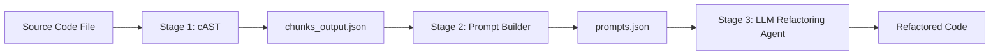

# AI-Powered Code Refactoring Pipeline

An end-to-end processing pipeline designed to ingest, chunk, and transform source code into high-quality, structured inputs for large language model (LLM) refactoring agents.

---

## 🏗️ High-Level Architecture



---

## 📁 Project Structure

*   **/input**: Place the source files or "messy" codebases to be refactored here $(e.g., `order_service.py`).
*   **/pipeline**: Contains the core modules of the refactoring engine:
    *   **[cAST](file:///c:/dev/SDP/pipeline/cast/)**: AST-based code chunking.
    *   **[Prompt Builder](file:///c:/dev/SDP/pipeline/prompt_builder/)**: Persona-driven prompt generation.
    *   **[LLM Agent](file:///c:/dev/SDP/pipeline/llm_agent/)**: Refactoring execution and file reconstruction.
*   **/output**: (Auto-generated) Stores intermediate JSON outputs (`chunks_output.json`, `prompts.json`) and final refactored files.
*   **[orchestrate.py](file:///c:/dev/SDP/orchestrate.py)**: The single entry point to run the entire pipeline end-to-end.

---

## 🚀 Getting Started

The easiest way to run the pipeline is using the orchestrator:

```bash
# Refactor a file in the input directory
python orchestrate.py input/order_service.py
```

### Advanced Options
```bash
# Specify an LLM model
python orchestrate.py input/order_service.py --model gemini-2.0-flash

# Refactor the file in-place (overwrites the original file)
python orchestrate.py input/order_service.py --in-place
```

---

## 📜 Project Documentation

*   **General History**: [LOG.md](file:///c:/dev/SDP/LOG.md)
*   **Stage 1 - cAST**: [pipeline/cast/README.md](file:///c:/dev/SDP/pipeline/cast/README.md)
*   **Stage 2 - Prompt Builder**: [pipeline/prompt_builder/README.md](file:///c:/dev/SDP/pipeline/prompt_builder/README.md)
*   **Stage 3 - LLM Agent**: [pipeline/llm_agent/README.md](file:///c:/dev/SDP/pipeline/llm_agent/README.md)

