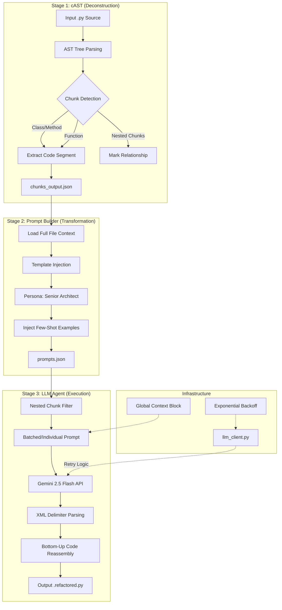

---

## 🎨 4. Detailed Architecture Workflow

---

## 🚀 5. Recent Quality Enhancements

### 1. Global Architectural Awareness
*   **Context Injection**: Every prompt now includes the **entire source file** inside a `Global Architectural Context` block.
*   **Result**: The LLM understands all class/function dependencies and global variables before modifying a specific chunk, preventing broken references and ensuring consistent naming across the file.

### 2. High-Confidence "Senior Architect" Persona
*   **Standardization**: Transformed the default persona from a generic "AI Coder" to a "Senior Software Architect specializing in code renovation."
*   **Focus Areas**: Code readability (Clean Code), comprehensive documentation (Docstrings, JSDoc), Single Responsibility Principle (SRP), and strict type hinting (Python 3.9+).

### 3. Fault-Tolerant Reassembly (Nested Filtering)
*   **Strategy**: To prevent file corruption when refactoring nested methods, the agent now calculates the "Inclusivity Scope" for every prompt. 
*   **Rule**: If `Chunk A` is contained within `Chunk B`, its prompt is automatically skipped during execution, as the parent's refactoring inherently includes the child.

### 4. Transition to Gemini 2.5 Flash
*   **Reasoning**: Upgraded the core engine to `gemini-2.5-flash` to leverage its superior reasoning capabilities and high token limits, allowing for massive "Global Context" prompts without sacrificing performance.

---

## 🛑 6. Known Constraints & Future Roadmap
*   **Top-Level Logic**: Codes residing in the global script scope (no function/class) are currently skipped. **Mitigation**: Future cAST versions will treat the remainder of the file as an "Orphan Chunk."
*   **Syntax Validation**: Currently relies on the LLM's accuracy. **Future**: Integrate `ruff` or `flake8` as post-processing "Linter Stage."
